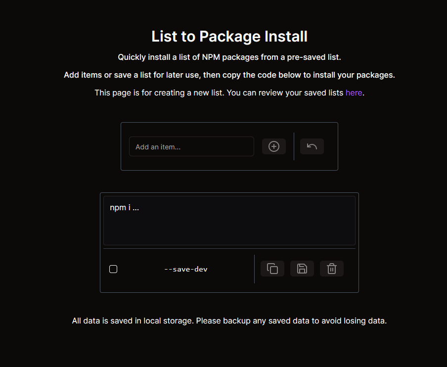
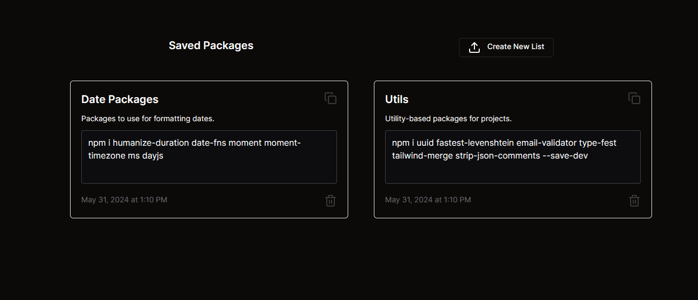

## Package List

A simple two-page PWA to quickly and easily save NPM package lists for efficient access. All saved packages are saved in local storage - no database nor cookies are involved.

## Resources Used

-   [Next.js](https://nextjs.org)
-   [Tailwind CSS](https://tailwindcss.com)
-   [shadcn UI](https://ui.shadcn.com)
-   [Lucide Icons](https://lucide.dev)
-   [Vercel](https://vercel.com)

## Screenshots




## Video Demonstration


## Getting Started

Install the required dependencies:

```bash
npm i
# or
yarn install
# or
pnpm install
# or
bun install
```

Then, run the development server:

```bash
npm run dev
# or
yarn dev
# or
pnpm dev
# or
bun dev
```

Open [http://localhost:3060](http://localhost:3060) in your browser. This is where you can preview your changes in real-time.

This project uses [`next/font`](https://nextjs.org/docs/basic-features/font-optimization) to automatically optimize and load Inter, a custom Google Font.

## Contributions

Contributions are welcome! Any discovered bugs or minor fixes/improvements should be discussed in an [Issue](https://github.com/peakh/package-list/issues) or [Pull Request](https://github.com/peakh/package-list/pulls), respectively.
